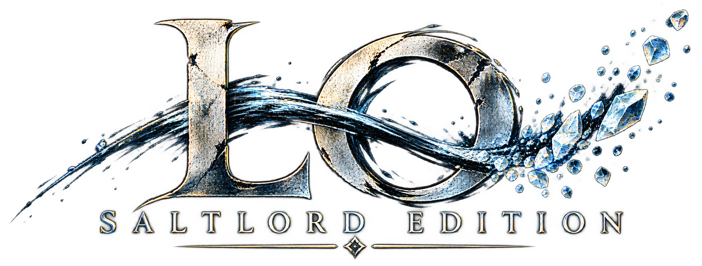
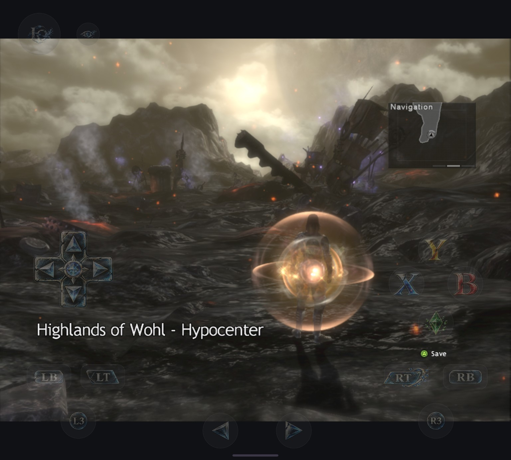
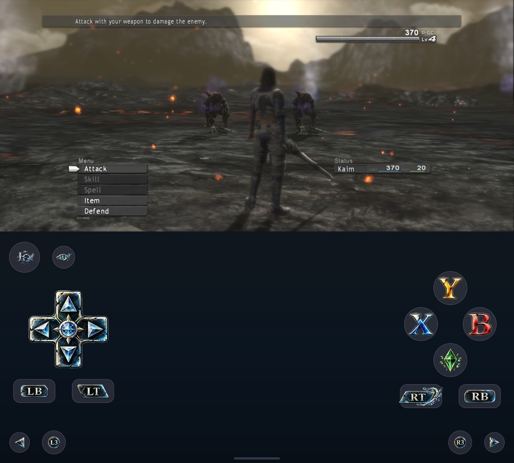
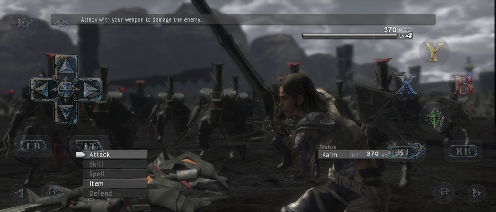
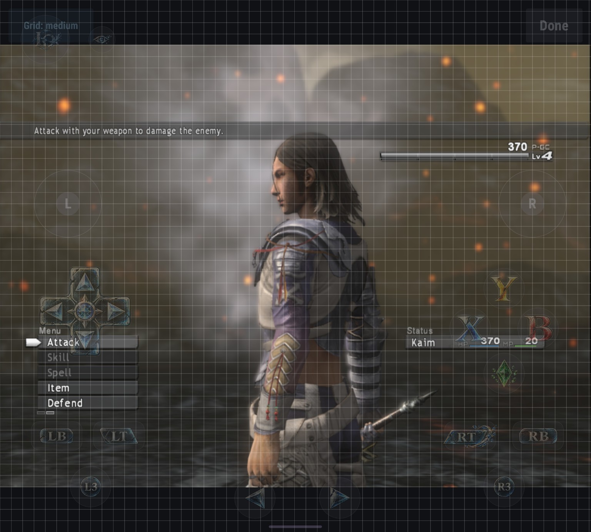
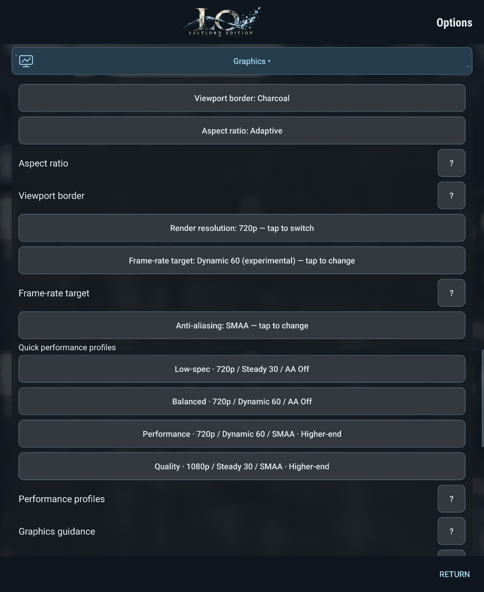
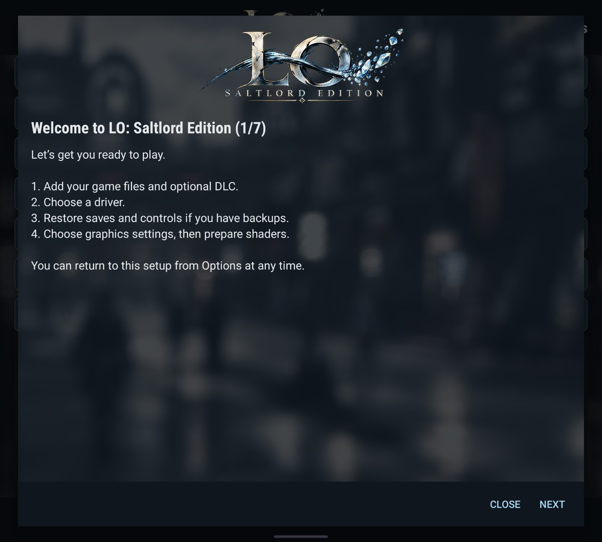
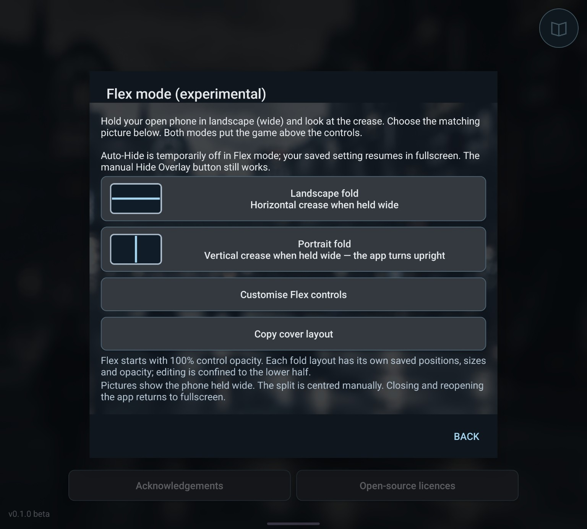

# LO: Saltlord Edition

An Android adaptation of [LostOdysseyRecomp](https://github.com/freefrank/LostOdysseyRecomp), with touch controls, foldable display layouts and guided setup. Developed and playtested by Saltlord (my gamer tag) on a Samsung Galaxy Z Fold 8 Ultra, with AI-assisted development.

**v0.1.0 Beta is available.** [Download the Android APK and checksum](https://github.com/Saltlordd/LO-SaltlordEdition/releases/tag/v0.1.0-beta). This is an early beta; device compatibility and later-game coverage are still being tested.

## Screenshots

### Gameplay on the inner display

Custom touch artwork and an adaptive viewport on the foldable inner display.

### Experimental Flex mode

Keep gameplay above a separate control pane, with its own layout and opacity settings.

### Widescreen cover display

Separate cover and inner layouts let you arrange controls for each display.

See the layout editor, graphics profiles and guided setup

### Touch layout editor

Move controls with adjustable grid snapping, including a free-placement option.

### Graphics profiles

Choose a quick profile or customise resolution, frame-rate target and anti-aliasing.

### Guided setup

Import game files, choose a driver, restore backups and prepare shaders through guided setup.

### Flex layout selection

Hinge diagrams help you choose an orientation. Both choices place gameplay above the controls.

Screenshots show the Android beta on the tester's device; they do not guarantee performance on other hardware.

## Saltlord Edition features

These are the Android experience additions and changes in this fork. The underlying game recompilation and runtime come from LostOdysseyRecomp; see the upstream credits below.

### Touch controls and personalisation

- Custom Lost Odyssey-themed, full-colour touch artwork, with a monochrome alternative.
- A layout editor with adjustable grid spacing and no-grid placement.
- Individual and overall control sizing, adjustable opacity, floating sticks and haptic feedback.
- Manual overlay hiding, automatic hiding and optional hiding when a controller connects.
- Separate saved layouts for cover and inner displays.
- Overlay layout backup and restore, including restoration during initial setup.

### Foldable displays and Flex mode

- Adaptive viewport fitting and a live 16:9 lock.
- Navy, charcoal or black viewport borders.
- Experimental Flex mode with the game above a dedicated lower-half control pane.
- Landscape-fold and portrait-fold choices, illustrated with hinge diagrams.
- Dedicated Flex layout editing, saved sizes and opacity, and a copy-cover-layout shortcut.
- Flex controls start at full opacity. Auto-hide is temporarily suspended; manual Hide still works.
- Flex mode is explicitly launched for a session; cold launches return to the ordinary fullscreen flow.

### Graphics and performance tools

- Four quick graphics profiles, available during setup and in Options.
- Resolution, anti-aliasing and frame-rate choices, with saved preferences between launches.
- Steady 30 and experimental Dynamic 60 targets; higher-workload combinations remain available after confirmation.
- Off, FXAA and SMAA anti-aliasing choices, with guidance about image clarity and workload.
- A configurable performance monitor with size, opacity and individual metric toggles. Android and driver support determine which metrics are available.
- Gameplay pauses while Options is open, without sending the game's Start button.

### Controllers, saves and setup

- Connected-controller selection, button/axis remapping and named controller profiles.
- Saved Fast Forward preferences.
- Save Anywhere, plus save ZIP backup and restore. Save Anywhere is not a save state; original Xbox 360 compatibility is unverified.
- Save and overlay restoration together during setup, to make migration easier.
- Guided game-disc/DLC import and custom GPU driver selection.
- First-run shader preparation with progress, optional notifications and a completion restart; later cached loads use a simpler loading screen.
- A dedicated app main menu with Start game, Options, Flex access, acknowledgements and licences.

### Diagnostics and offline operation

- Local diagnostic reports exported to a location chosen through Android's file picker.
- Bug-report guidance with the device, driver, settings and reproduction details needed for investigation.
- No automatic report sending. This beta requests no INTERNET permission.

## Getting started

Use a compatible ARM64 Android device (Android 9/API 28 or newer). Hardware and driver compatibility vary; testing has primarily used the Z Fold 8 Ultra.

1. Install the release APK, then choose **Start game**.
2. Follow setup to import your own supported game discs and optional DLC. No game files are distributed here.
3. Restore backups if needed, choose graphics settings and your driver, then allow shader preparation to complete. Keeping the app foregrounded can finish faster; progress notifications are optional.
4. When initial compilation finishes, choose **Restart now** to begin with the saved cache.

Updates can be installed over an existing build signed with the same key. Before uninstalling or clearing app data, export saves and layouts somewhere outside app storage.

## Graphics profiles

| Profile | Render resolution | Frame target | Anti-aliasing |
| --- | --- | --- | --- |
| Low-spec | 720p | Steady 30 | Off |
| Balanced | 720p | Dynamic 60 | Off |
| Performance | 720p | Dynamic 60 | SMAA |
| Quality | 1080p | Steady 30 | SMAA |

Low-spec is the conservative fresh-install default. Performance and Quality suit more capable hardware. SMAA produced clearer 720p edges/text than FXAA in the tester's experience; FXAA can look soft or muddy.

**Dynamic 60 targets up to 60 FPS.** It neither changes resolution dynamically nor guarantees a minimum frame rate. 1080p/60, with or without AA, remains selectable after workload confirmation. In one Z Fold 8 Ultra test, 1080p/60/AA Off approached 60 in lighter sections and fell to roughly 32–42 in demanding cutscene intervals. These are scene/device observations, not guarantees. 1080p/30/SMAA provided steadier pacing in the supplied tests.

## Beta limitations

- First-encounter pipeline/graphics hitches can remain despite shader preparation and recorded-pipeline warmup. We do not promise a completely stutter-free playthrough.
- Flex mode is experimental and intended for a foldable's inner display. Auto-hide is temporarily suspended there; manual Hide still works. Ordinary cold launches return to the main menu/fullscreen flow.
- Some upstream PC settings are unavailable or inappropriate on Android. Change them cautiously for testing and revert if problems occur.
- Save Anywhere is not a save state. Compatibility of these saves with the original Xbox 360 release is not established; keep ordinary saves/backups.
- Monitor FPS counts game presentations, not screen refreshes. Thermal status reports Android heat pressure, not chipset temperature; GPU utilisation may be unavailable.

## Bug reports

Use **Options → Setup, features & reports → Save diagnostic report** and choose a location in Android's file picker. Review the file before sharing. Email it to **saltlordstrikes@gmail.com**, or attach it to an issue on this fork.

Include app version, device model, RAM, storage, chipset, driver, graphics choices, screen/Flex mode, controller, what happened, what you expected, and steps to reproduce. Mention whether it occurs every time or on first encounter; screenshots/video help. Reports contain local diagnostics and no save backup.

## Source, credits and licence

See [Android build notes](docs/ANDROID_BUILD.md), [credits](docs/SALTLORD_CREDITS.md) and the [upstream README](README.upstream.md). LostOdysseyRecomp and its contributors provide the underlying recompilation/runtime. This fork preserves upstream licensing and notices; see [LICENSE](LICENSE). This Android source tree excludes game assets, generated game code, private logs, saves and signing keys.
