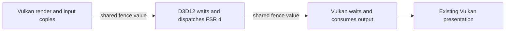

# Vulkan frame generation, FSR 4 and MetalFX feasibility

Source review: 2026-10-01. Repository baseline: `ca0d8fa`. Development branch:
`feat/vulkan-frame-generation`. This note distinguishes implemented changes from
integration plans. No new GPU/display acceptance is claimed.

## Result

| Feature / platform | Evidence and current decision |
|---|---|
| DLSS FG, Windows Vulkan | Extend the existing Streamline integration: persisted settings, fixed 2×–6× requests gated by SDK capabilities, live multiplier/Off changes, and an explicit restart requirement when the process started without FG hooks. Implemented on this branch. |
| DLSS dynamic MFG, Vulkan | Streamline 2.14.1 documents dynamic MFG as D3D12-only. Rejected explicitly. Fixed MFG is a separate capability. |
| FSR 3.1.4 FG, Windows Vulkan | Official SDK 1.1.4 includes a Vulkan frame-generation provider and replacement swapchain. Feasible, but requires a four-queue integration and timeline synchronization absent from the current application. Not enabled by this branch. |
| DLSS FG, native Linux Vulkan | The pinned official Streamline release provides Windows DLLs and no native Linux FG runtime. The guide's Linux optical-flow driver note does not establish availability of that runtime. No native Linux integration claimed. |
| FSR 3.1.4 FG, native Linux Vulkan | GPU algorithm sources exist; the pinned Vulkan swapchain/pacer depends on Win32 synchronization, threads and timing. A native presenter port is required. Existing Linux FSR SR remains available. |
| FSR 4 upscaling, Windows | SDK 2.3 includes FSR Upscaling 4.1.1 through the FidelityFX API and a signed DX12 runtime. Native D3D12 integration is feasible; Vulkan requires an additional DX12 interop layer, as demonstrated by OptiScaler. Research complete; implementation is a separate adapter/interop project. |
| FSR 4 frame generation, Windows | Separate from FSR 4 upscaling. SDK 2.3 documents FG 4.0.1, Windows 11, Agility SDK 1.4.9 and Radeon 9000-series or later. No official Vulkan backend in SDK 2.3. |
| FSR 4, native Linux | SDK 2.3 does not supply this project's needed native Vulkan/Linux path. Running a Windows mod through Wine/Proton is a different deployment model from linking a native Linux game. |
| MetalFX FG, macOS | Apple provides frame interpolation from macOS 26. Runtime device support must be queried. This game has no Metal backend selection/macOS build preset, and its non-Windows address-space implementation uses Linux `memfd_create`. A macOS platform/rendering port must precede integration. No stub provider added. |

## Changes implemented here

The previous Windows Vulkan DLSS path parsed only environment variables and
accepted fixed 2×. The settings menu advertised FG only for D3D12, even when the
Vulkan Streamline code was compiled. The Vulkan path now uses the same saved
provider, multiplier and environment-precedence rules as D3D12.

- `LO_FG_PROVIDER=off` still beats the saved provider and `LO_DLSS_FG=1`.
- An explicit provider override retains its whole-request defaults; individual
  overrides otherwise replace saved fields. Legacy On remains fixed 2×.
- Vulkan exposes only compiled DLSS support. FSR FG and dynamic Vulkan MFG are
  rejected; Linux never advertises a Windows-only adapter.
- Fixed 2×–6× requests translate to one through five generated frames. The
  session queries `slDLSSGGetState().numFramesToGenerateMax`; an excessive request
  leaves ordinary rendering active, without silently changing the multiplier.
- Settings changes drain producer/host/SDK work before changing the session.
  Off stops input capture. An already installed Streamline proxy stays alive so
  Off → On and multiplier changes can use the existing device. The proxy and
  immediate presentation policy are retained while Off; restart with FG Off to
  return to an ordinary swapchain without that overhead.
- Starting with FG Off creates an ordinary Vulkan device. First enabling FG
  therefore requires restart, with a specific menu/status message. A failed
  startup is reported unavailable, rather than asking for repeated restarts.
- VRR pacing uses the selected fixed multiplier once runtime availability has
  been observed. SDK counters remain diagnostic observations, not display proof.
- The presentation output extent may differ from the native scene's extent.
  Same-frame producer/resolve identity checks remain in place; depth/motion keep
  their actual render dimensions and Streamline receives swapchain dimensions.
  Uniform scaling to a full backbuffer is admitted; letterboxed/pillarboxed
  presentation still requires a future subregion-tag integration. This removes
  an obsolete rejection of scaled native-resolution input, without changing SR
  selection or guest frame rate.

Build with the existing `LO_ENABLE_STREAMLINE_FG=ON`, local official
`LO_STREAMLINE_SDK_ROOT`, and the native NGX SDK requirements from
[`LoStreamline.cmake`](../../cmake/LoStreamline.cmake). SDK versions and required
runtime files remain pinned by the [existing manifest](../../tools/tests/streamline_fg/sdk-manifest.json).
No SDK binaries are added to this repository.

Choose Vulkan and DLSS FG in Graphics, save, and restart if prompted. A diagnostic
launch can instead set:

```powershell
$env:LO_GRAPHICS_API = 'vulkan'
$env:LO_FG_PROVIDER = 'dlss'
$env:LO_FG_MODE = 'fixed'
$env:LO_FG_MULTIPLIER = '2' # 2..6, subject to the SDK-reported maximum
```

Historical fixed-2× acceptance and its known SDK validation report remain in
[the earlier record](gate1-host-repair-20260927.md). They do not validate new
multiplier/menu behavior on this branch.

## FSR 3.1.4 Vulkan implementation plan

Use the pinned SDK **1.1.4**, not SDK 2.3: the latter explicitly lists Vulkan as
unsupported. SDK 1.1.4's FFX API builds `amd_fidelityfx_vk.dll` with
`FFX_API_BACKEND=VK_X64`. Relevant public types include:

- `ffxCreateBackendVKDesc` for device/physical-device/procedure lookup.
- `ffxCreateContextDescFrameGenerationSwapChainVK` for four queue descriptors and
  the native swapchain create description.
- `ffxQueryDescSwapchainReplacementFunctionsVK` for replacement create, destroy,
  get-images, acquire and present functions.
- `ffxDispatchDescFrameGenerationSwapChainWaitForPresentsVK` for SDK presenter
  retirement; the ordinary host-render fence is insufficient.

The SDK's `FrameInterpolationSwapChainVK::init` explicitly rejects aliasing
between **game, async compute, present and image-acquire queues**. Setting
`allowAsyncWorkloads=false` does not remove that initialization requirement.
Plume creates up to four queues in selected families, but its virtual-queue
allocator can share native queues. The game currently uses one presentation
queue. Passing that same queue four times is not a usable integration.

A complete adapter needs the following boundaries before it can be enabled:

1. Query and enable timeline-semaphore support at device creation. Reserve four
   distinct suitable native queues, verify surface presentation support, and
   prevent later Plume queue allocation from taking SDK-owned queues. Preserve
   ordinary rendering if this is unsupported.
2. Install the FFX replacement WSI functions before swapchain creation. Respect
   Plume's create-new-before-destroy-old resize sequence, allocator lifetime,
   host queue mutexes and SDK worker submissions. `vkDeviceWaitIdle` alone must
   not race an SDK thread that can submit more work.
3. Reuse `CompositeHandoff`, same-frame depth/motion, `BuildCamera` and the depth
   remapper. Configure the frame ID before Prepare, then let the SDK generate
   and pace the extra frame. Keep source snapshots alive through host completion
   **and** SDK input/presenter completion.
4. Test Off/On, unsupported queues, missing runtime, rejected acquire/present,
   resize, minimized windows, cancellation before submit, and teardown. Begin
   with fixed 2× and the composited backbuffer, matching the present D3D12 scope.

For Linux, port the SDK presenter's Windows threads, events, critical sections,
QPC timing and waiting before exposing the same provider. A custom paced Vulkan
presenter is another possible design, but requires its own ownership/timing
validation. The existing SR-only `LoFsr.cmake` deliberately removes the FG
swapchain callback and builds neither optical-flow nor interpolation shaders;
changing its option name or dropping in another library does not add FG.

## FSR 4 and what OptiScaler demonstrates

Reviewed OptiScaler commit `5dc144e29a1ba6fd63549dcabf20bce814d01e6a`.
Its README lists Vulkan FSR 4 through **DX12 interop**. `FFXFeatureVkOn12`
constructs a `FFXFeatureDx12`; `IFeature_VkwDx12` implements shared images,
Windows handles, shared fences/semaphores and submission splitting. Its OptiFG
section explicitly says **DX12 only**. Vulkan SR support therefore cannot be
used as evidence that OptiScaler supplies a ready Vulkan FG presenter.

The game currently calls the statically compiled
`ffxFsr3UpscalerContextCreate/Dispatch` functions. It does not use the modern
FFX API upscaler DLL, so a driver-level FSR upgrade or replacing a DLL beside the
game cannot be assumed to upgrade this path.

For a supported Windows implementation, first add a D3D12 adapter using the
signed `amd_fidelityfx_upscaler_dx12.dll`, query provider versions for the actual
device and verify the selected provider after context creation. SDK 2.3's
Upscaling 4.1.1 documentation lists Radeon 7000-series **discrete** GPUs and
9000-series or later. Do not apply that SR hardware statement to FG 4: the FG
4.0.1 documentation has the narrower requirement shown above.

The current depth, motion, jitter, camera and color inputs are useful here.
Query resource requirements rather than unconditionally disabling reactive and
transparency masks: FSR 4 makes them optional, while a selected FSR 3 fallback
can still need them. Expose the actual selected version, and preserve SR/FG as
independent choices. FG 4 also requires the documented
Configure → Prepare → Generate call order and accurate camera basis data.

After native D3D12 validation, the Vulkan SR bridge can follow this sequence:



The bridge must match the DXGI adapter to the Vulkan physical device's LUID,
query each format/usage's external-memory compatibility, import/export shared
resources, and implement external queue-family ownership transfers. Input copy,
upscale and output reuse must all participate in the submission/lifetime model.
OptiScaler's Windows APIs (`CreateSharedHandle`, `vkGetMemoryWin32HandlePropertiesKHR`,
`vkImportSemaphoreWin32HandleKHR`, `D3D12_FENCE` handles) explain both its
feasibility and why it is not a native Linux implementation. Its performance
cost is workload-dependent; no OptiScaler benchmark is presented as a game
measurement here. No OptiScaler source was copied into the runtime.

## MetalFX FG on macOS

Apple's `MTLFXFrameInterpolatorDescriptor` is available from **macOS 26.0**.
Call `supportsDevice(_:)` for the actual Metal device; OS availability alone is
not a GPU capability check. The Metal 4 path additionally has
`supportsMetal4FX(_:)`; the ordinary `MTLFXFrameInterpolator` interface encodes
into an `MTLCommandBuffer`.

A future adapter can reuse the provider-neutral camera/history/input contracts,
but must supply actual Metal color, previous-color where required, depth,
motion and output textures, plus jitter, camera matrices, frame delta and reset
information. `requiresPrevColorTexture` and the optional associated scaler
control the history inputs. UI composition has explicit API properties; our
current composited-backbuffer inputs do not establish separated HUD rendering.
The interpolation effect encodes GPU work; the application still needs to
schedule and present the generated and rendered frames through Metal/CAMetalLayer.

The repository's Plume dependency has a Metal implementation, but the application
chooses only D3D12/Vulkan, compiles rendering shaders for DXIL/SPIR-V, and has no
macOS preset. Its non-Windows guest-address-space allocator calls
`syscall(SYS_memfd_create, ...)`, which requires a macOS replacement that
preserves the guest's fixed-address alias mappings. These are concrete platform
prerequisites, rather than a missing MetalFX header alone.

The implementation sequence is: establish a macOS game/renderer build; select a
native Metal backend and shader conversion path; provide retained same-frame
Metal resources; add the interpolator and a paced presenter; then validate on
supported Apple hardware. A MoltenVK bridge would instead need explicit Metal
object export and cross-API synchronization validation; a `VkImage` cannot be
cast to an `MTLTexture`. This branch does not claim that either port exists.

## Validation and remaining acceptance

The standalone CPU suite covers selection/override precedence, build/platform
availability, fixed multiplier limits, existing input ownership and completion,
runtime recovery, and production menu interaction/raster contracts:

```sh
cmake -S tools/tests/streamline_fg -B out/vulkan-fg/contracts -DLO_STREAMLINE_FG_CPU_ONLY=ON
cmake --build out/vulkan-fg/contracts --parallel 4
ctest --test-dir out/vulkan-fg/contracts --output-on-failure
```

The game compile workflow now also builds the Vulkan session, depth remapper,
Streamline runtime and dispatch through `LO_VULKAN_FG_GAME_COMPILE_CHECK=ON`,
including `video.cpp` with both Vulkan and D3D12 FG enabled. It uses the pinned
headers and no proprietary game assets or SDK execution.

Local evidence is retained under ignored `out/vulkan-fg/`:

- Linux GCC: **17/17** CPU/menu tests passed. The updated scaled-presentation
  contract was rebuilt and passed after the final geometry change.
- Windows x64 executables cross-compiled with MinGW GCC 14: **17/17** tests
  passed under Wine 10, including the Windows-only provider/restart menu flow.
  The existing D3D12 settings/VRR regression also passed under Wine. This is
  CPU execution evidence, not a Windows graphics-driver test.
- Production `video.cpp` compiled for Windows Vulkan FG, Windows Vulkan plus
  D3D12 FG, and Linux. The Vulkan session, depth remapper and dispatch compiled
  against the pinned public SDK headers. The shared-runtime variant of
  `streamline_runtime.cpp` compiled as well.
- The standalone runtime's unchanged `sl_security.h` needs Windows SDK
  `WINTRUST_SIGNATURE_SETTINGS` definitions absent from this MinGW distribution.
  That variant still needs the native MSVC/ClangCL workflow above. Signature
  verification was not removed or replaced to make a local check pass.

There is no physical GPU in this executor.
The new Vulkan multipliers, live reconfiguration, scaled native input, resize
and actual generated-frame presentation still require a Windows NVIDIA hardware
run. FSR/MetalFX plans above have not been compiled or executed as game providers.

## Primary sources

- [Streamline 2.14.1 release](https://github.com/NVIDIA-RTX/Streamline/releases/tag/v2.14.1) and [pinned DLSS-G programming guide, fixed/dynamic MFG](https://github.com/NVIDIA-RTX/Streamline/blob/2122257e0fce486f91b385aa63b9a09b0a34b363/docs/ProgrammingGuideDLSS_G.md#62-enabling-multi-frame-generation).
- [FidelityFX 1.1.4 Vulkan FFX API types](https://github.com/GPUOpen-LibrariesAndSDKs/FidelityFX-SDK/blob/c6efa6bf7f2027b3ec94f28578bb5965eabb9e55/ffx-api/include/ffx_api/vk/ffx_api_vk.h), [swapchain implementation](https://github.com/GPUOpen-LibrariesAndSDKs/FidelityFX-SDK/blob/c6efa6bf7f2027b3ec94f28578bb5965eabb9e55/sdk/src/backends/vk/FrameInterpolationSwapchain/FrameInterpolationSwapchainVK.cpp) and [Win32 presenter declarations](https://github.com/GPUOpen-LibrariesAndSDKs/FidelityFX-SDK/blob/c6efa6bf7f2027b3ec94f28578bb5965eabb9e55/sdk/src/backends/vk/FrameInterpolationSwapchain/FrameInterpolationSwapchainVK.h).
- [FSR SDK 2.3 Vulkan limitation](https://github.com/GPUOpen-LibrariesAndSDKs/FidelityFX-SDK/blob/v2.3.0/Kits/FidelityFX/readme.md), [Upscaling 4.1.1](https://github.com/GPUOpen-LibrariesAndSDKs/FidelityFX-SDK/blob/v2.3.0/Kits/FidelityFX/docs/techniques/super-resolution-ml.md), [FG 4.0.1](https://github.com/GPUOpen-LibrariesAndSDKs/FidelityFX-SDK/blob/v2.3.0/Kits/FidelityFX/docs/techniques/frame-interpolation-ml.md) and [FFX API/provider selection](https://github.com/GPUOpen-LibrariesAndSDKs/FidelityFX-SDK/blob/v2.3.0/Kits/FidelityFX/docs/getting-started/ffx-api.md).
- [OptiScaler support matrix](https://github.com/optiscaler/OptiScaler/blob/5dc144e29a1ba6fd63549dcabf20bce814d01e6a/README.md), [Vulkan-to-DX12 resource/synchronization implementation](https://github.com/optiscaler/OptiScaler/blob/5dc144e29a1ba6fd63549dcabf20bce814d01e6a/OptiScaler/upscalers/IFeature_VkwDx12.cpp), and [FFX Vulkan-on-DX12 adapter](https://github.com/optiscaler/OptiScaler/blob/5dc144e29a1ba6fd63549dcabf20bce814d01e6a/OptiScaler/upscalers/ffx/FFXFeature_VkOn12.cpp).
- [Apple frame-interpolator descriptor](https://developer.apple.com/documentation/metalfx/mtlfxframeinterpolatordescriptor), [device-support query](https://developer.apple.com/documentation/metalfx/mtlfxframeinterpolatordescriptor/supportsdevice(_:)), and [frame-interpolator resource contract](https://developer.apple.com/documentation/metalfx/mtlfxframeinterpolatorbase).
